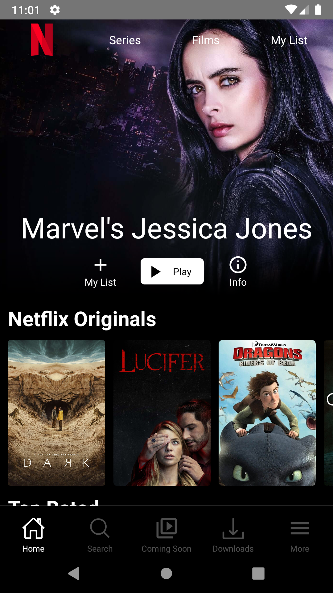
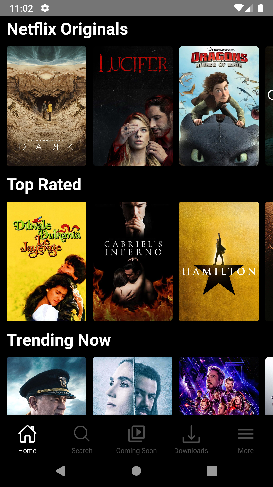
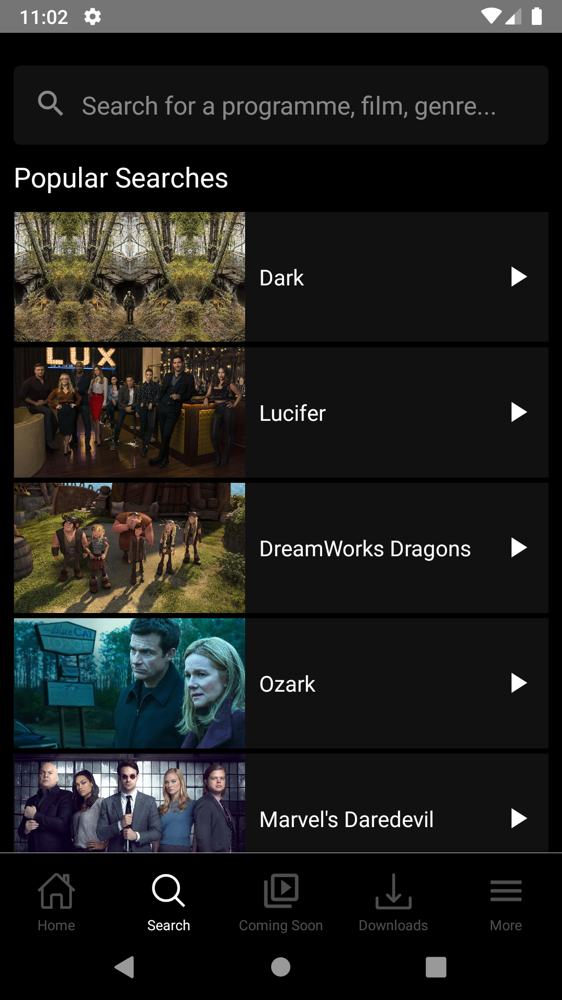

<h1 align="center">Netflux APP</h1>

<p align="center">Netflix clone with backend, frontend and mobile using Node.js, ReactJs and React Native</p>

<p align="center">
  
</p>
<p align="center">
  
</p>
<p align="center">
  
</p>

## :computer: Technologies

* [React Native](https://reactnative.dev/)
* [React Navivation](https://www.npmjs.com/package/@react-navigation/native)
* [Axios](https://www.npmjs.com/package/axios)
* [React Native Dotenv](https://www.npmjs.com/package/react-native-dotenv)
* [React Native Linear Gradient](https://www.npmjs.com/package/react-native-linear-gradient)
* [React Native Vector icons](https://www.npmjs.com/package/react-native-vector-icons)
* [VS Code](https://code.visualstudio.com/) with [ESLint](https://marketplace.visualstudio.com/items?itemName=dbaeumer.vscode-eslint)

## :information_source: How To Use

To clone and run this application, you'll need [Git](https://git-scm.com) installed on your computer and  [netflux-api](https://github.com/filipem2210/netflux-api). From your command line:

```bash
# Clone this repository
$ git clone https://github.com/filipem2210/netflux-app

# Go into the repository
$ cd netflux-app

# Install dependencies
$ yarn install

# Run the app (iOS)
$ react-native run-ios --simulator="iPhone XS Max"

# Run the app (Android)
$ react-native run-android
```

## :memo: License

This project is under the MIT license. See the [LICENSE](https://github.com/filipem2210/netflux-app/blob/master/LICENSE) for more information.

## :mortar_board: Author

| [<br><sub>@filipem2210</sub>](https://github.com/filipem2210) |
| :---: |
